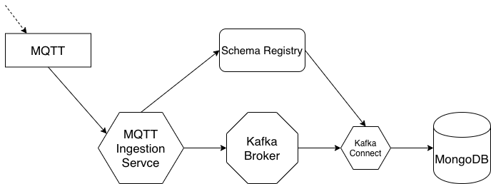
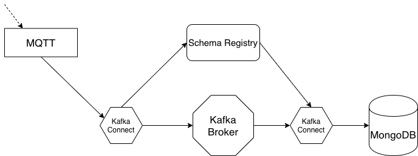
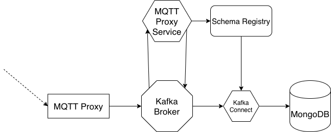

# Descrizione del sistema da realizzare

Lo scopo di questo progetto è quello di realizzare un sistema che sia in grado di raccogliere (potenzialmente molti) dati da uno o più sistemi esterni, processarli velocemente e renderli disponibili per un'analisi dettagliata con tecniche opportune, raccogliendoli in un data store adeguato. In particolare si utilizzeranno come input i dati forniti dal dataset open sugli spostamenti urbani di Tokyo [OpenPFLOW](https://github.com/sekilab/OpenPFLOW), che verranno dapprima riversati su [Kafka](https://kafka.apache.org/) attraverso una interfaccia MQTT e poi riorganizzati all'interno di [MongoDB](https://www.mongodb.com/).

# Architettura

L'architettura di questo progetto prevede che i dati siano inviati attraverso una interfaccia MQTT e che siano opportunamente depositati all'interno di un database MongoDB. Per fare questo sono state realizzate tre differenti modelli architetturali che, sempre supportandosi sopra Kafka, utilizzano diverse tecnologie. Le tre architetture sono illustrate qui di seguito.

## Architettura con broker MQTT e servizio di ingestione dei dati custom (service architecture)
In questa prima architettura si utilizza un broker MQTT come prima interfaccia verso l'esterno. I dati che arrivano su un topic vengono letti da un servizio custom ed inviati a Kafka tramite un producer. Il servizio in questo scenario si occupa anche di rimappare il messaggio sul topic MQTT sia in struttura che in formato per renderlo subito pronto ad assere depositato su MongoDB. Per far questo si usa l'apposito (Sink) Connector che legge dal topic Kafka e scrive in una apposita collezione su database.

## Architettura con broker MQTT e utilizzo di Kafka Connect per l'ingestione dei dati (connector architecture)
Questa architettura è molto simile alla prima con la differenza che invece di usare un servizio custom come ponte tra il broker MQTT e Kafka, si usa un (Source) Connector. Il dato in ingresso è ancora convertito di formato ma la struttura rimarrà inalterata. Come per la prima architettura, sarà un connettore ad occuparsi di trasferire i dati dal topic Kafka a MongoDB. 

## Architettura con Kafka MQTT Proxy per l'ingestione dei dati (proxy architecture)
In questa architettura non si utilizza più un vero e proprio broker MQTT, ma si utilizzerà invece il Kafka MQTT Proxy il quale consente di esporre una interfaccia MQTT ma di usare direttamente Kafka come protocollo. Questo fa si che il dato "grezzo" sul topic, prima di arrivare al database, debba essere ristrutturato e convertito. Per fare questo viene aggiunto un semplice servizio Kafka Streams che converte i dati dal topic "MQTT" e li riscrive convertiti in un altro topic. Di nuovo, un connettore leggerà da quest'ultimo topic e depositerà i dati in MongoDB.

## Servizio di acquisizione dati

Il servizio di acquisizione si pone come interfaccia tra i sistemi esterni che generano i dati e il sistema interno atto a processarli e renderli disponibili per ulteriori analisi. Il servizio dovrà essere in grado di integrarsi facilmente con diversi tipi di sorgenti; potrebbe in prima istanza esporre una interfaccia REST usabile da un client (come ad esempio una applicazione mobile) per inviare i dati degli spostamenti. Un'altra interfaccia potrebbe essere quella verso un broker MQTT per poter ingestionare gli eventi esposti da dispositivi IoT. Avendo già a disposizione un batch di eventi sotto forma di csv, un'altra interaccia potrebbe essere l'acquisizione di dati in bulk situati, ad esempio, in un repository s3.

Qualsiasi sia il formato, i dati dovranno essere inviati a Kafka usando Avro.

## Passaggio dati da Kafka a MongoDB

Una volta che i dati sono all'interno del topic Kafka è possibile accedervi e depositarli in altri data store in diversi modi. È possibile creare un servizio consumer che legge dal topic e scrive sulla destinazione scelta oppure, se non ci sono complesse trasformazioni da effettuare, è possibile usare il servizio Kafka Connect che semplifica il transito di dati da e per Kafka da specifiche sorgenti. Esistono già diversi connettori per i database più comuni (compreso MongoDB) ma è comunque possibile scriverne uno ad hoc. In questo caso useremo il connettore già disponibile.

Il formato e il layout dei dati su MongoDB è da stabilire e verrà definito in seguito.

## Integration test

Essendo un sistema composto da molti elementi distinti, è interessante considerare lo sviluppo di test di integrazione end-to-end. Una proposta potrebbe essere quella di scrivere una piccola applicazione che, leggendo i molti dati già disponibili in formato csv, li immetta come eventi nel sistema attraverso la o le interfaccie che si decideranno di implementare. I dati inseriti dovranno quindi poter essere controllati tramite semplici query sul sitema finale (MongoDB in questo caso). A livello pratico è possibile usare Docker per istanziare il sistema in ambiente locale, ma un uso di questo test su altri ambienti dovrebbe essere facilmente eseguibile semplicemente cambiando gli indirizzi di puntamento dei vari sistemi tramite configurazione.
