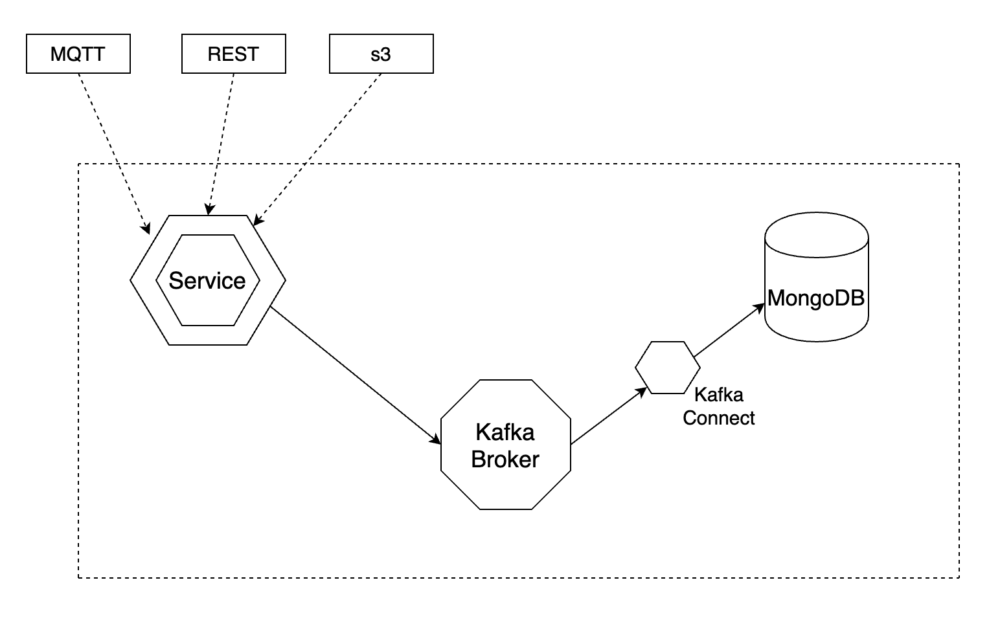

# Descrizione del sistema da realizzare

Lo scopo di questo progetto è quello di realizzare un sistema che sia in grado di raccogliere (potenzialmente molti) dati da uno o più sistemi esterni, processarli velocemente e renderli disponibili per un'analisi più dettagliata con tecniche opportune, raccogliendoli in un data store adeguato. In particolare si utilizzeranno come input i dati forniti dal dataset open sugli spostamenti urbani di Tokyo [OpenPFLOW](https://github.com/sekilab/OpenPFLOW), che verranno dapprima riversati su [Kafka](https://kafka.apache.org/) e poi riorganizzati all'interno di [MongoDB](https://www.mongodb.com/).

## Architettura

I dati in ingresso verranno gestiti da un servizio che si occuperà di ricevere gli eventi e di scriverli su Kafka. Questo servizio potrà esporre le interfacce di ricezione che si riterranno più opportune. I dati potranno arrivare tramite una interfaccia REST oppure essere acquisiti da un broker MQTT. Il servizio dovrà comunque poter essere facilmente esteso per poter acquisire i dati dalla sorgente più opportuna.

La gestione dei dati su Kafka avverrà usando il formato [Avro](https://avro.apache.org/), ormai standard nonché consigliato. Una volta depositati nel topic, i dati verranno riversati in MongoDB usando il [connettore Kafka apposito](https://www.mongodb.com/kafka-connector).

## Servizio di acquisizione dati

Il servizio di acquisizione si pone come interfaccia tra i sistemi esterni che generano i dati e il sistema interno atto a processarli e renderli disponibili per ulteriori analisi. Il servizio dovrà essere in grado di integrarsi facilmente con diversi tipi di sorgenti; potrebbe in prima istanza esporre una interfaccia REST usabile da un client (come ad esempio una applicazione mobile) per inviare i dati degli spostamenti. Un'altra interfaccia potrebbe essere quella verso un broker MQTT per poter ingestionare gli eventi esposti da dispositivi IoT. Avendo già a disposizione un batch di eventi sotto forma di csv, un'altra interaccia potrebbe essere l'acquisizione di dati in bulk situati, ad esempio, in un repository s3.

Qualsiasi sia il formato, i dati dovranno essere inviati a Kafka usando Avro.

## Passaggio dati da Kafka a MongoDB

Una volta che i dati sono all'interno del topic Kafka è possibile accedervi e depositarli in altri data store in diversi modi. È possibile creare un servizio consumer che legge dal topic e scrive sulla destinazione scelta oppure, se non ci sono complesse trasformazioni da effettuare, è possibile usare il servizio Kafka Connect che semplifica il transito di dati da e per Kafka da specifiche sorgenti. Esistono già diversi connettori per i database più comuni (compreso MongoDB) ma è comunque possibile scriverne uno ad hoc. In questo caso useremo il connettore già disponibile.

Il formato e il layout dei dati su MongoDB è da stabilire e verrà definito in seguito.

## Integration test

Essendo un sistema composto da molti elementi distinti, è interessante considerare lo sviluppo di test di integrazione end-to-end. Una proposta potrebbe essere quella di scrivere una piccola applicazione che, leggendo i molti dati già disponibili in formato csv, li immetta come eventi nel sistema attraverso la o le interfaccie che si decideranno di implementare. I dati inseriti dovranno quindi poter essere controllati tramite semplici query sul sitema finale (MongoDB in questo caso). A livello pratico è possibile usare Docker per istanziare il sistema in ambiente locale, ma un uso di questo test su altri ambienti dovrebbe essere facilmente eseguibile semplicemente cambiando gli indirizzi di puntamento dei vari sistemi tramite configurazione.
